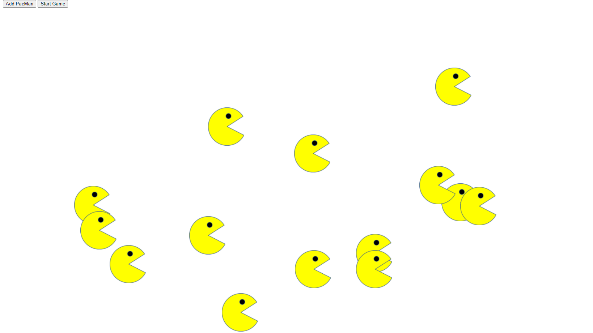

# PacMen Factory

## Description

This project creates PacMen with the click of a button and then moves them bounces them around in the browser window.

## Installation

Download the files into a directory of your liking and click on the index.html file or open the file from the browser of your choice. Click on the Add PacMen button to create PacMen at will and then click start game to bounce the PacMen.

### Future Improvements

To improve this game I will add code to change colors and change size of the PacMen when they hit the walls of the browser window.
<a href="https://jfernandez0524.github.io/pacMen/">View Repo Here</a>

### Other Repos

| Repo        | Page                                           |
| ----------- | ---------------------------------------------- |
| Eyes        | [https://jfernandez0524.github.io/eyes/]       |
| Bus Tracker | [https://jfernandez0524.github.io/busTracker/] |

## License

MIT License

Copyright (c) 2022 JFernandez0524

Permission is hereby granted, free of charge, to any person obtaining a copy
of this software and associated documentation files (the "Software"), to deal
in the Software without restriction, including without limitation the rights
to use, copy, modify, merge, publish, distribute, sublicense, and/or sell
copies of the Software, and to permit persons to whom the Software is
furnished to do so, subject to the following conditions:

The above copyright notice and this permission notice shall be included in all
copies or substantial portions of the Software.

THE SOFTWARE IS PROVIDED "AS IS", WITHOUT WARRANTY OF ANY KIND, EXPRESS OR
IMPLIED, INCLUDING BUT NOT LIMITED TO THE WARRANTIES OF MERCHANTABILITY,
FITNESS FOR A PARTICULAR PURPOSE AND NONINFRINGEMENT. IN NO EVENT SHALL THE
AUTHORS OR COPYRIGHT HOLDERS BE LIABLE FOR ANY CLAIM, DAMAGES OR OTHER
LIABILITY, WHETHER IN AN ACTION OF CONTRACT, TORT OR OTHERWISE, ARISING FROM,
OUT OF OR IN CONNECTION WITH THE SOFTWARE OR THE USE OR OTHER DEALINGS IN THE
SOFTWARE.
